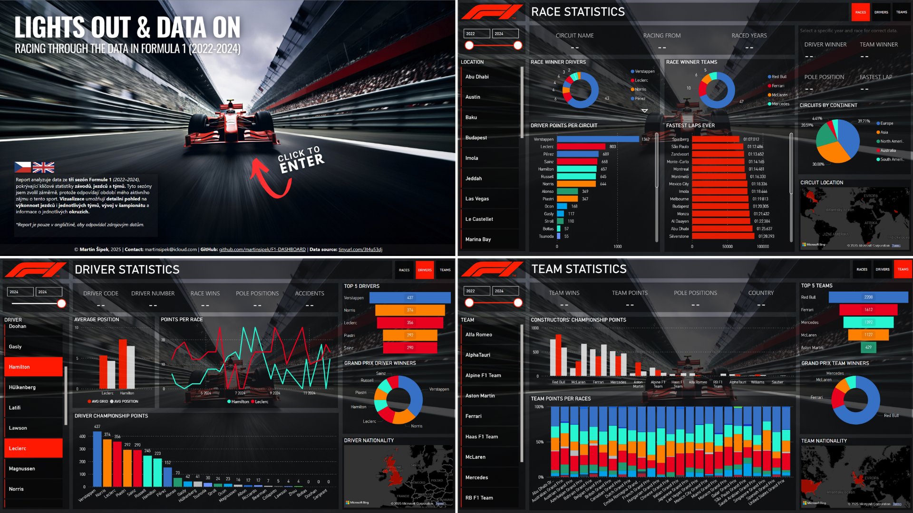

## Power BI Certification Project: Light Out & Data On 🏎️💨

Vizualizační projekt v Power BI nad daty Formule 1 v období 2022 - 2024. 

Projekt slouží jako ukázka mých dovedností v oblasti práce s daty a jejich vizualizace v Power BI. Zároveň byl využit jako certifikační projekt v rámci akademie, kde bylo cílem prakticky aplikovat analytické schopnosti, zpracování dat a tvorbu interaktivního dashboardu.

## O projektu 📊
Cílem bylo vytvořit přehledný a interaktivní dashboard, který:
- Pokrývá sezóny v období 2022 - 2024
- Obsahuje vstupní homepage a další listy, které kategorizují report na okruhy, piloty a týmy
- Má funkční interaktivní navigaci pro přepínání mezi jednotlivými stránkami
- Využívá DAX a Power Query pro výpočty, míry i kalkulované sloupce
- Má držet jednotné rozložení vizuálů napříč stránkami pro větší přehlednost
- Využívá co možná nejvíce různých vizuálů (ne ale na úkor logiky a přehlednosti)

## Vytvořeno za pomocí 💻
- **Power BI Desktop** 
- **Power Query** – pro úpravu dat
- **DAX** – další výpočty, míry a kalkulované sloupce
- **Dataset**: [Formula 1 World Championship (1950–2020)](https://www.kaggle.com/datasets/rohanrao/formula-1-world-championship-1950-2020)

## Obsah repozitáře 📂
- `/visuals` – detailní pohled na jednotlivé listy reportu a tabulkové zobrazení modelu
- `README.md` – tento popis projektu
- `preview.png` - náhled reportu

## 🧠 Poznámka
Tento projekt byl vytvořen jako ukázka a data vychází z veřejného datasetu. Ačkoliv byla data kontrolována, neručím za jejich 100% přesnost. 

## 👨🏽‍💻 Vypracoval
Martin Šípek, 2025, martinsipek@icloud.com

